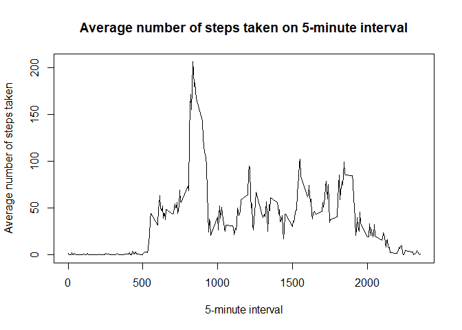
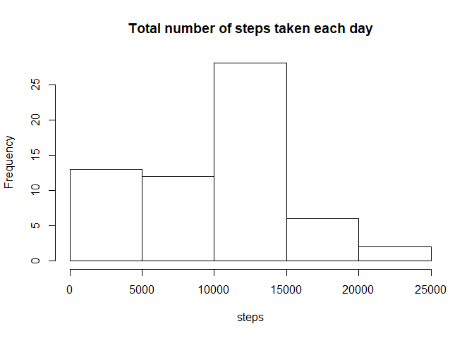
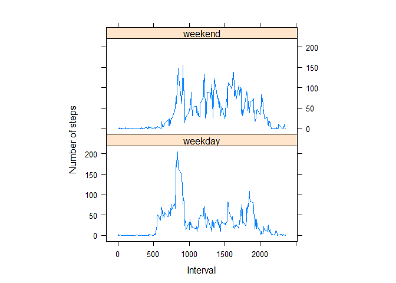

## Loading and preprocessing the data

```r
suppressPackageStartupMessages(library(dplyr))
##Load the data
data <- read.csv("activity.csv", na.strings = "NA")

##Process/transform the data (if necessary) into a format suitable for your analysis
data$date <- as.Date(data$date)
```

## What is mean total number of steps taken per day?

```r
##Make a histogram of the total number of steps taken each day
daily <- data %>% 
        group_by(date) %>%
        summarize(total.n.steps = sum(steps, na.rm = TRUE))

hist(x = daily$total.n.steps,
     main = "Total number of steps taken each day",
     xlab = "steps")
```

<!-- -->

```r
##mean and median total number of steps taken per day
mean <- mean(daily$total.n.steps)
median <- median(daily$total.n.steps)
mean
```

```
## [1] 9354.23
```

```r
median
```

```
## [1] 10395
```


## What is the average daily activity pattern?

```r
##Make a time series plot (i.e. type = "l") of the 5-minute interval 
##(x-axis) and the average number of steps taken, averaged across all days (y-axis)

avg <- data %>%
        group_by(interval) %>%
        summarize(avg_steps = mean(steps, na.rm=TRUE))

plot(x = avg$interval,
     y = avg$avg_steps,
     type = "l",
     main = "Average number of steps taken on 5-minute interval",
     xlab = "5-minute interval",
     ylab = "Average number of steps taken")
```

<!-- -->

```r
##Which 5-minute interval, on average across all the days in the dataset, 
##contains the maximum number of steps?

avg$interval[which(avg$avg_steps == max(avg$avg_steps))]
```

```
## [1] 835
```


## Imputing missing values

```r
##Calculate and report the total number of missing values in the dataset (i.e. the total number of rows with NAs)
length(which(is.na(data$steps)))
```

```
## [1] 2304
```

```r
##Devise a strategy for filling in all of the missing values in the dataset. 
##The strategy does not need to be sophisticated. For example, you could use the mean/median for that day, 
##or the mean for that 5-minute interval, etc.

impute_mising_values <- function(df){
        ##First we grab all missing values from data
        miss <- df[which(is.na(df$steps)),]
        
        ##then we compute median values for each interval
        median_values <- df %>%
                                group_by(interval) %>%
                                summarize(median_steps = median(steps, na.rm=TRUE))
        
        ##finally we impute the missing values using median values
        imputed <- merge(miss,
                         median_values,
                         by=c("interval"),
                         all.x = TRUE)
        
        imputed$steps <- imputed$median_steps
        
        imputed <- imputed %>%
                select(-median_steps)
        
        imputed_df <- merge(df,
                            imputed,
                            by=c("date",
                                 "interval"),
                            all.x = TRUE)
        
        imputed_df$steps <- ifelse(is.na(imputed_df$steps.y),
                                   imputed_df$steps.x,
                                   imputed_df$steps.y)
        
        imputed_df <- imputed_df %>% 
                select(-c(steps.x, steps.y))

        print(paste0(nrow(miss),
                     " rows data imputed"))
        
        return(imputed_df)
}

##Create a new dataset that is equal to the original dataset but with the missing data filled in.
imputed <- impute_mising_values(data)
```

```
## [1] "2304 rows data imputed"
```

```r
##Make a histogram of the total number of steps taken each day and Calculate and report the mean and median 
##total number of steps taken per day. Do these values differ from the estimates from the first part of the assignment? 
##What is the impact of imputing missing data on the estimates of the total daily number of steps?
daily.imputed <- imputed %>% 
                        group_by(date) %>%
                        summarize(total.n.steps = sum(steps, na.rm = TRUE))


hist(x = daily.imputed$total.n.steps,
     main = "Total number of steps taken each day",
     xlab = "steps")
```

<!-- -->

```r
mean.imputed <- mean(daily.imputed$total.n.steps)
median.imputed <- median(daily.imputed$total.n.steps)
##minor difference compare to first part of assignment
mean.imputed
```

```
## [1] 9503.869
```

```r
##same as first part of assignment
median.imputed
```

```
## [1] 10395
```


## Are there differences in activity patterns between weekdays and weekends?

```r
library(lattice)
##For this part the weekdays() function may be of some help here. 
##Use the dataset with the filled-in missing values for this part.
imputed$weekdays <- weekdays(imputed$date)
imputed$weekdays <- ifelse(imputed$weekdays %in% 
                                   c("Saturday",
                                     "Sunday"),
                           "weekend",
                           "weekday")

avg <- imputed %>%
        group_by(interval,
                 weekdays) %>%
        summarize(avg_steps = mean(steps, na.rm=TRUE))

xyplot(avg_steps~interval|factor(weekdays),
       data=avg,
       aspect=1/2,
       type="l",
       xlab = "Interval",
       ylab = "Number of steps")
```

<!-- -->

